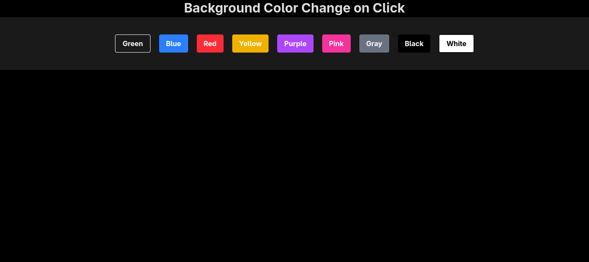

# react-learn

A simple repository to learn and experiment with React and with mini projects.

## Prerequisites
- Node.js (LTS recommended)
- npm (or yarn/pnpm)

## Getting Started
1. Install dependencies:
   ```bash
   npm install
   ```
2. Start the development server (use the one that exists in package.json):
   ```bash
   npm run dev   # e.g., Vite/Next/etc.
   ```


## Screenshots

Mini Projects

|04-props |05-bgChanger | |
|:---:|:---:|:---:|
| <a href="https://github.com/mukund58/react-learn/tree/master/04-props/playing%20with%20props"></a> | <a href="https://github.com/mukund58/react-learn/tree/master/05-bgChanger/bgChnage"></a> | <a href="public/"></a> |
| <strong>Creating Componets Using Props</strong> | <strong>Background Changer</strong> | <strong></strong> |

## Learn More
- React Docs: https://react.dev/
- Vite Docs (if used): https://vitejs.dev/guide/
- Create React App Docs (if used): https://create-react-app.dev/docs/getting-started/
